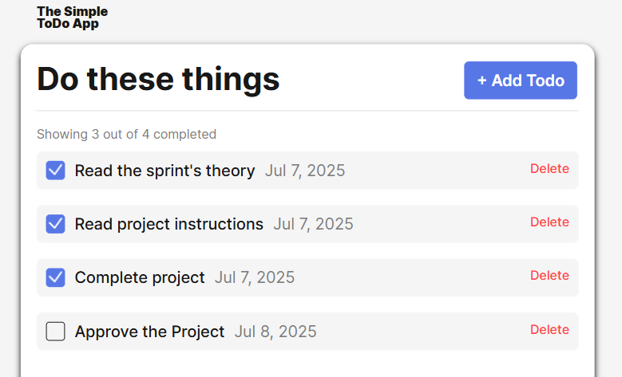

# Simple Todo App

A minimalistic, single-page Todo application built with vanilla JavaScript, HTML, and CSS. This app allows users to manage their daily tasks efficiently by adding, completing, and deleting todos. The project is designed for learning and demonstration purposes.

## Functionality

- **Add Todos:** Enter a task in the input field and add it to your todo list.
- **Mark as Complete:** Click the checkbox next to a todo to mark it as completed. Completed todos are visually distinguished.
- **Delete Todos:** Remove tasks from your list with the delete button.
- **Persistent Storage:** Todos are saved in your browser's local storage, so your list remains after refreshing the page.
- **Responsive Design:** The app works well on both desktop and mobile devices.

## Technology

- **HTML5:** Semantic structure for accessibility and clarity.
- **CSS3:** Responsive and clean styling.
- **JavaScript (ES6):** Handles all app logic, DOM manipulation, and local storage.

## Deployment

This project is deployed on GitHub Pages:

- [View the live app here](https://itsjaydenking.github.io/se_project_todo-app/)
